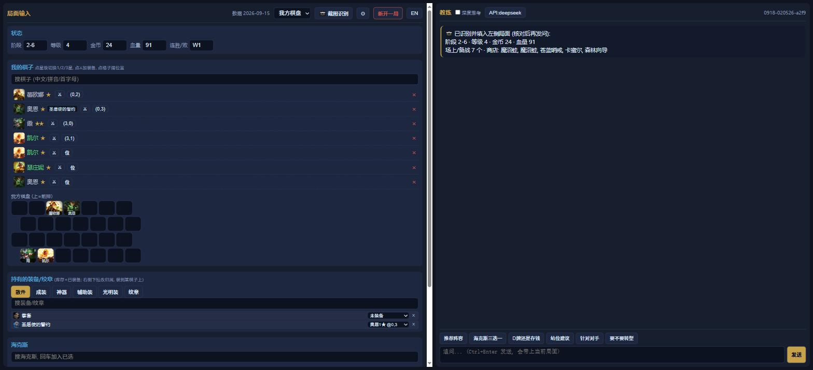
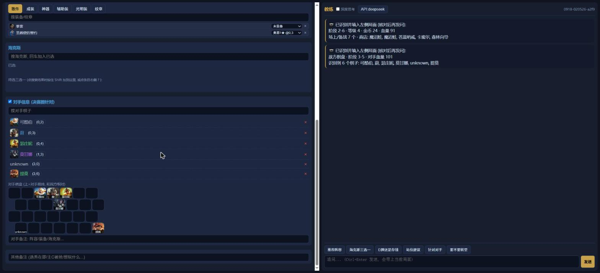
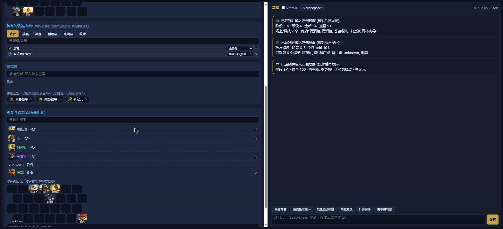
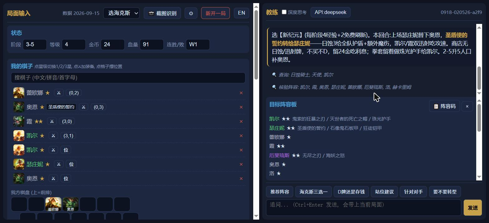
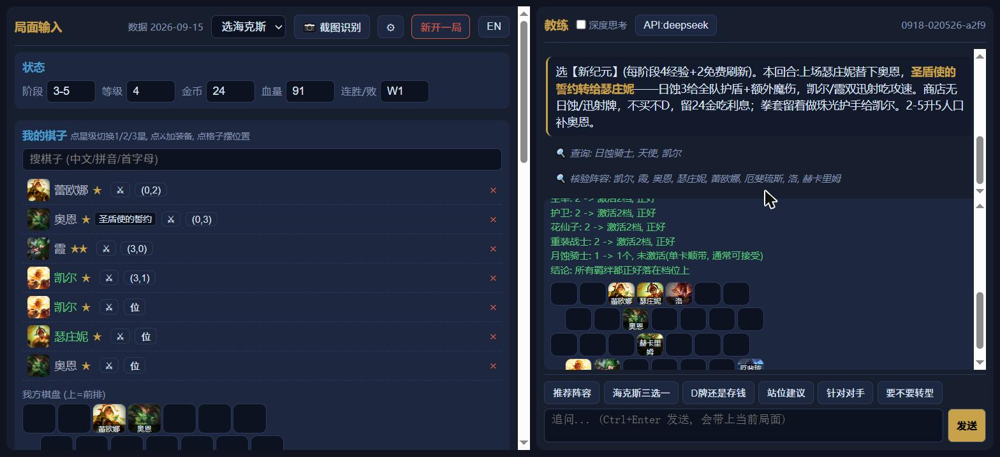

# TFT Copilot

[English](README.md)

对局中辅助 **定阵容 / 选海克斯 / D牌决策 / 站位** 的 Agent 助手。

工作方式：把当前局面喂给 agent → agent 结合内置的赛季数据 + Meta 梯度知识，给出精简的建议和一套常驻「目标阵容」。局面可以两种方式录入：

1. **手动**：网页左栏点选（棋子 / 装备 / 海克斯 / 状态 …）；
2. **截图自动识别**：📷 上传或 `Ctrl+V` 粘贴一张 1920×1080 游戏截图，本地视觉服务识别成结构化局面，回填到界面。

## 截图

| 识别我方棋盘 | 识别对手棋盘 | 识别海克斯 |
|---|---|---|
|  |  |  |

上面三张截图用的就是 [`examples/`](examples/) 里的示例图（见下面"用示例截图试试"）。注意对手棋盘上没有装备图标——这是故意的，不是 bug（见"设计理念"一节和 `known_issues.md`）。



Agent 的推荐，上面能看到它调用的工具（🔍 查询/核验阵容）和目标阵容板。

---

## 这个仓库里有什么

这是本项目的开源版本：完整的后端/视觉/前端**框架**、赛季数据包，以及训练好的视觉模型权重(ONNX，单独分发，见下文)。

**不包含**：训练这些模型用的标注图像数据集，以及训练代码——训练需要一份不在本次开源范围内的私有数据集，没有数据集光放训练脚本也没用。你拿到的是推理链路（只需要 `onnxruntime`，不需要 torch），可以直接对你自己的截图跑识别。

**许可证**：[PolyForm Noncommercial 1.0.0](LICENSE.md) — 个人/爱好/研究用途免费，商用请联系作者。

---

## 架构

```
┌─────────────────────────────────────────────────────────────┐
│  frontend/  (纯静态 HTML/JS/CSS, 由主后端托管)                 │
│    左栏: 录入局面   右栏: 教练对话                              │
└───────────┬───────────────────────────────┬─────────────────┘
            │ ①截图 POST /api/recognize      │ ②POST /api/chat (带 state)
            ▼                                 ▼
┌───────────────────────────┐   ┌───────────────────────────────┐
│ 视觉识别 API   :8010        │   │ 主功能后端 API   :8000          │
│ vision/  (onnxruntime)     │   │ backend/ (FastAPI + agent)      │
│ 本地 CV/OCR, 截图→局面       │   │ 赛季数据包+知识库                │
│ 无需 torch, 无需联网         │   │ SSE 流式建议 + 结构化目标阵容     │
└───────────────────────────┘   └───────────────────────────────┘
```

两个都是开了 CORS 的独立 FastAPI 服务，可以分开部署（比如把视觉服务放到另一台机器上）。根目录的 `run.py` 会在一个进程里把两个都起起来。

---

## 设计理念

这个项目的核心判断是：agent 擅长判断、语言表达、根据具体局面调整建议，但不擅长精确计算和记住精确数值。所以不是简单指望它"别说错"，而是给它一小组确定性工具去调用——任何有唯一正确答案的东西都不靠它自己算，并且在它给出最终答案后，后端还会用同一套逻辑再核验一遍。

- **`verify_comp`**（`backend/knowledge.py` 的 `analyze_comp`）：精确计算阵容里每个羁绊的数量、激活到哪一档、溢出还是差几个，纹章带来的羁绊也算进去。系统提示词要求 agent 在给出任何最终阵容前先调用这个工具核验；后端也会对 agent 最终给出的阵容再跑一遍同样的核验（`backend/app.py` 里的 `attach_trait_check`），不管 agent 有没有自己调用工具都会附上确定性结果——错误的羁绊计数不会未经核验就到你眼前。
- **`lookup_details`**：强制 agent 从数据包里查这个赛季的真实数值（属性、技能文字、装备合成），而不是凭预训练记忆去编——那些记忆一旦游戏更新就过期了。

大致的设计原则是：让 agent 负责推理和表达，但任何"能数清楚"或"能查到"的东西都不能只靠它自己说了算。如果你要给这个项目加新机制、需要精确核验，`backend/app.py` 里的 `TOOL_HANDLERS` 这套"工具调用 + 服务端再核验"的模式就是该接进去的地方。



`verify_comp` 对一次真实推荐的实际输出：每个羁绊精确到档位，外加站位板。

---

## 环境配置

需要 **Python 3.10+**。不需要编译、不需要打包、不需要 license 文件——把依赖装进你自己平时用的 Python 环境（系统 Python、`venv`、conda 都行，项目本身不帮你建环境），然后跑起来：

```bash
# 1) 把依赖装进你自己选的环境, 比如:
python -m venv .venv && source .venv/bin/activate   # 可选; 或者激活你的 conda env, 或者直接用系统 Python
pip install -r requirements.txt

# 2) 下载模型权重(可选; 只用手动录入的话可以跳过)
#    去本仓库 GitHub Releases 下载 onnx-models-*.zip, 解压到 vision/onnx/
#    (见 vision/onnx/README.md)

# 3) 配置模型服务商密钥 (agent 靠这个驱动)
cp .env.example .env
# 编辑 .env, 填 DEEPSEEK_API_KEY (或 ANTHROPIC_API_KEY 用 Claude)

# 4) 运行 (一次性把主功能后端和视觉服务都起起来)
python run.py
```

浏览器打开 `http://localhost:8000`（手机在同一 WiFi 下用 `http://<电脑IP>:8000`）。

---

## 用示例截图试试

[`examples/`](examples/) 里放了三张现成的 1920×1080 截图（`my_board.png`、`enemy_board.png`、`augments.png`），不用真的开一局游戏，直接点 📷 上传这几张就能试截图识别。

**游戏必须设置成窗口模式、分辨率正好 1920×1080**，截图也必须正好是这个分辨率、不带多余边框——差一点就会跟识别用的固定 HUD 坐标对不上。建议用 [Snipaste](https://www.snipaste.com/) 直接截游戏窗口（它截的是窗口客户区的原始像素，不会缩放），不要用系统自带截图工具之类会缩放或带边框的。其他尺寸的截图都用不了。

已知的识别问题见 [`known_issues.md`](known_issues.md)。

---

## 关于英文支持

界面本身的文案（按钮/标签/提示）有 中/EN 切换（左上角 `EN`/`中` 按钮），默认跟随浏览器语言。

**目前还是中文的部分**：赛季数据包（棋子/装备/海克斯名）和教练的回答内容，因为底层数据源目前是国服 locale（`config.yaml` 里的 `region: cn` / `locale: zh_cn`）。`scripts/fetch_data.py` 已经支持切换 CDragon 的其它 locale——做一份英文数据包 + 让模型用英文回答，是个合理的后续贡献方向，只是这次开源没做。

---

## 前端 (`frontend/`)

纯静态页面，由主后端 `GET /` 托管（会给 `app.js/style.css` 附上按文件修改时间的版本号，改了刷新即生效，免清缓存）。

- **左栏 — 录入局面**（全部选填）：状态条（阶段/等级/金币/血量/连胜败）、我的棋子（星级、装备、拖到棋盘摆位）、持有的装备（库存+已装备统一面板，可分配到棋子）、海克斯（已选 + 三选一）、对手信息。
- **搜索**：支持拼音/首字母/社区简称，别名表 `data/aliases_cn.json`；搜索框留空点一下会展开浏览面板（英雄按费用/羁绊筛，装备按分类）。
- **截图识别**：顶部选模式（我方棋盘 / 选海克斯）→ 📷 上传，或页面内直接 `Ctrl+V` 粘贴剪贴板截图 → 调视觉 API → 回填局面（⚙ 里设视觉服务地址/密钥）。
- **右栏 — 教练对话**：快捷按钮一键提问或打字追问；一局共享一个会话，教练记得整局脉络。「目标阵容板」常驻显示模型给的目标阵容，有变化才更新（省 token），板上「Team code」一键复制、游戏内队伍规划器可直接导入。
- **API 面板**（`config.yaml` 里 `allow_user_key: true` 时出现）：使用者可切供应商、选模型、贴自己的 key（存浏览器 localStorage，优先于服务端 key）。

---

## 后端接口

完整字段说明见英文版 [README.md](README.md#backend-api)（结构是 JSON/代码，语言无关）。简要：

- `GET /api/data` — 前端启动时拉的全部静态数据
- `POST /api/session` — 新建会话
- `POST /api/chat` — 核心对话接口，SSE 流式，见 `state` 结构（棋子/装备/海克斯/对手信息等）
- 视觉 API (`vision/vision_api.py`, 默认 `:8010`) 见 `vision/API.md`

---

## 数据 & 知识

- `data/packs/set18/`：赛季数据包，由 `scripts/build_pack.py` 从 CDragon 构建。
- `knowledge/general_strategy.md`：跨赛季通用策略层（手写）。
- `knowledge/resident_pack.md`：常驻知识包（生成，进 system prompt，吃上下文缓存）。
- `knowledge/meta_comps.md`：Meta 梯度层（`scripts/fetch_meta.py` 生成）。
- 按需知识：后端根据局面注入相关实体详情；模型也可用 `lookup_details`/`verify_comp` 工具自查。

**版本更新后**：依次跑 `scripts/fetch_data.py` → `scripts/build_pack.py` → `scripts/build_search_index.py`（以及 `scripts/fetch_meta.py` 更新 Meta 层）即可跟上版本改动。[`skills/tft-update/SKILL.md`](skills/tft-update/SKILL.md) 把这一整套流程逐步写清楚了，包括怎么核对结果（比如揪出"注册了但实际不在当前投放池"的装备）。如果你用 [Claude Code](https://claude.com/claude-code)，把这个文件夹放进你的 `.claude/skills/` 目录，就能变成一个可以直接跑的 `/tft-update` 命令；不用 Claude Code 的话照着它手动走一遍，或者直接跑脚本也一样。

---

## 配置 (`config.yaml`)

- `set` / `region` / `locale`：数据源的赛季 / 服务器 / 语言。
- `persist_sessions`：`false` 时会话只存内存、不落盘 `data/sessions/`（省存储，重启后对话历史丢失；浏览器里的局面不受影响）。
- `llm.provider` / `allow_user_key` / `providers`：默认供应商、是否允许用户自填 key、各供应商的可选模型（DeepSeek 走 OpenAI 兼容接口，Claude 走官方 anthropic SDK）。

---

## 目录结构

```
backend/        主功能后端 (FastAPI + agent + 知识库)
frontend/       前端 (静态 HTML/JS/CSS)
vision/         视觉识别服务 (本地 CV/OCR + onnx 模型) + hud/ 子模块
scripts/        数据构建/更新 (fetch_data, build_pack, build_search_index, fetch_meta, check_pool)
data/packs/     赛季数据包       data/vision_dataset/  视觉运行时协议/区域文件
knowledge/      策略/常驻/Meta 三层知识
skills/tft-update/   赛季数据更新流程 (可以单独看着走, 也可以当 Claude Code skill 用)
examples/       三张 1920x1080 测试截图 (见上面"用示例截图试试")
known_issues.md 已知的识别问题
config.yaml     全局配置          .env.example  复制成 .env 后填密钥
requirements.txt   装进你自己的环境    run.py   一次起两个服务
LICENSE.md      PolyForm Noncommercial 1.0.0
```
